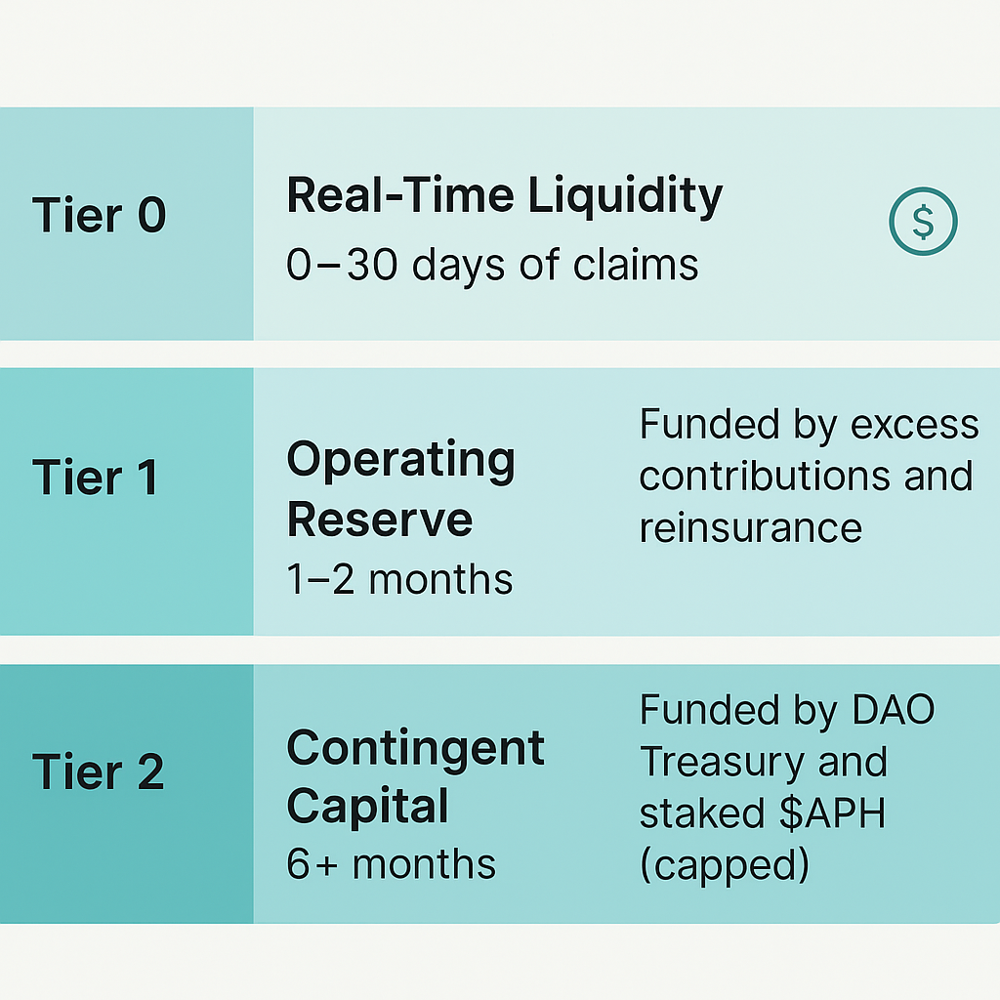

> Forward‑Looking Statement: This document contains forward‑looking statements subject to significant risks and uncertainties. Nothing herein is investment, legal, or medical advice. Features, timelines, and parameters are examples and remain subject to DAO approval and market/regulatory conditions.

# Actuarial & Capitalization Specification (Public Summary)

This document summarises Apollo Care’s actuarial methodology and capitalisation framework.  Full technical details reside in the private actuarial specification; the summary here conveys the high‑level design without exposing proprietary formulas.

## Risk‑Managed Contribution Algorithm (R‑MCA)

Apollo’s Risk‑Managed Contribution Algorithm determines each member’s monthly contribution.  It uses actuarially grounded factors and is governed by the DAO.  Key components include:

### Age‑Band Factors

Contributions vary by broad age bands – children, young adults, mid‑age adults, older adults and pre‑Medicare groups – to reflect expected healthcare costs【214961381664349†L56-L73】.  Older bands carry higher factors, but ratios are capped (e.g., the oldest‑to‑youngest adult contribution ratio is limited to 3:1) to maintain fairness and comply with regulations【214961381664349†L69-L74】.

### Household Composition

To support families, contributions add a fixed percentage per child up to a cap (commonly 40% of the primary adult’s rate for up to three children)【214961381664349†L80-L100】.  Additional adults pay their own age‑band rate【214961381664349†L80-L87】.

### Risk Factor Multipliers

The R‑MCA includes surcharges for tobacco use and region.  Smokers may pay 20‑50% more, subject to regulatory caps【214961381664349†L103-L116】, and rates can be adjusted by geography to reflect regional healthcare cost differences【214961381664349†L117-L124】.  Other risk factors (e.g., high‑risk occupations) can be added by governance.

### Base Contribution Formula (Illustrative)

Combining these elements produces a base contribution.  The following pseudocode illustrates the calculation【214961381664349†L133-L149】:

```python
# Simplified base contribution example (subject to DAO approval)
base_contrib = age_factor * base_rate_adult
base_contrib *= (1 + child_factor * min(num_children, 3))  # cap at 3 children
base_contrib *= tobacco_factor * region_factor

# Add administrative loadings and reserve margin
required_contribution = base_contrib * (1 + admin_load + reserve_margin)

# Apply ShockFactor (see below) to handle extraordinary events
final_contribution = required_contribution * shock_factor
```

Administrative and reserve margins cover operating costs and build reserves【214961381664349†L151-L169】.  These parameters are set by the Actuarial Committee and approved by the DAO.  Subsidy programmes (e.g., income‑based credits) may reduce contributions for lower‑income members through governance decisions【214961381664349†L197-L201】.

## Capital Adequacy & Reserve Policy

Apollo monitors a **Capital Adequacy Ratio (CAR)** – the ratio of available capital to expected claims – and aims for **CAR ≈ 125%**【214961381664349†L590-L613】.  Available capital includes Tier 1 reserves and the liquidation value of Tier 2 (treasury and staked tokens).  When CAR approaches threshold levels (e.g., 100%), automatic triggers such as ShockFactor increases or enrolment throttles may be activated【214961381664349†L590-L609】.  Maintaining CAR at 125% provides a cushion comparable to or exceeding traditional insurers【214961381664349†L610-L613】.

## Claims Pricing & Adjudication

Apollo’s Claims Pricing and Adjudication Engine (CPCA) processes claims via a three‑lane workflow【214961381664349†L745-L749】:

1. **Fast‑Lane Auto‑Approvals** – Small, routine claims under a threshold are instantly approved and paid【214961381664349†L745-L764】.  Limits on value and frequency prevent abuse.
2. **AI‑Assisted Triage** – Medium claims are evaluated by machine‑learning algorithms against coverage rules, price databases and fraud indicators; most are approved within minutes【214961381664349†L785-L844】.  Flags trigger human oversight.
3. **Community & Committee Review** – Complex or large claims, or those flagged by AI, are reviewed by the elected Claims Committee within a defined timeframe; exceptionally large claims may require a DAO vote【214961381664349†L845-L899】.  Members can appeal decisions through on‑chain governance.

This tiered process balances speed and fairness while leveraging community oversight to mitigate fraud and moral hazard.

## ShockFactor & Governance Triggers

**ShockFactor** is a governance‑controlled multiplier applied to all contributions during extraordinary events【214961381664349†L172-L195】.  By default ShockFactor = 1.0.  In emergencies (e.g., large claim surges or market disruptions), the Actuarial Committee can raise ShockFactor within preset limits (e.g., up to +20%) without a full DAO vote【214961381664349†L172-L195】.  Larger adjustments require DAO approval.  When reserves return to target levels, ShockFactor can be reduced or surplus rebated to members.

Other governance triggers include:

* **Enrollment throttles:** to protect solvency, the Actuarial Committee may pause or slow new member onboarding if capital falls below safe thresholds【214961381664349†L1575-L1584】.
* **Claim payment modulation:** in extreme situations, non‑urgent claims can be temporarily deferred or partially paid, subject to DAO oversight【214961381664349†L1586-L1603】.
* **Red‑zone capital calls:** if CAR drops dramatically (e.g., ShockFactor > 1.5 needed), pre‑defined governance proposals may trigger capital raises, special assessments, benefit adjustments or liquidation of reserve tokens【214961381664349†L1615-L1634】.
* **Transparency dashboards:** on‑chain telemetry displays reserve levels, CAR and ShockFactor status; members can monitor metrics and propose adjustments【214961381664349†L1655-L1668】.

## Three‑Tier Reserve & Claims Waterfall

Apollo’s reserves operate in three tiers【214961381664349†L590-L637】:

* **Tier 0 – Liquidity Buffer:** on‑hand USDC for real‑time claim payments.  Continuously refilled by contributions【214961381664349†L618-L623】.
* **Tier 1 – Operating Reserve:** covers 1–2 months of claims and absorbs regular volatility【214961381664349†L624-L629】.
* **Tier 2 – Contingent Capital:** comes into play for extreme events; uses DAO Treasury funds first, then capped staked $APH【214961381664349†L630-L681】.

### Reserve Tiers Diagram

The following diagram summarises the scope, coverage horizon and funding sources for each tier.



Claims follow an automated waterfall: pay from Tier 0; refill Tier 0 from incoming contributions; draw from Tier 1 if needed; activate Tier 2 if Tier 1 is depleted【214961381664349†L642-L687】.  Staked tokens are liquidated only after the treasury portion of Tier 2 is exhausted, and any use of Tier 2 raises alerts to the DAO【214961381664349†L670-L687】.  The waterfall logic and diagram are detailed in `docs/claims-liquidity-waterfall.md`.

## Reinsurance & Shock Absorption

Beyond reserves, Apollo purchases external reinsurance to cap aggregate losses and uses the staked $APH pool as a decentralized backstop.  These layers, combined with ShockFactor and enrolment throttles, provide multiple levers to maintain solvency and recover after extreme events.

## Governance & Legal Context

All actuarial parameters (age bands, loadings, ShockFactor limits, reserve targets, subsidy schedules, etc.) are governed by the Actuarial Committee and the DAO.  Apollo operates through a DAO LLC wrapper, providing legal recognition while maintaining on‑chain governance【830535318348417†L50-L73】.  Members gain coverage through USDC contributions and are not liable beyond their contributions【214961381664349†L1570-L1584】.

> Forward‑Looking Statement: This document contains forward‑looking statements subject to significant risks and uncertainties. Nothing herein is investment, legal, or medical advice. Features, timelines, and parameters are examples and remain subject to DAO approval and market/regulatory conditions.