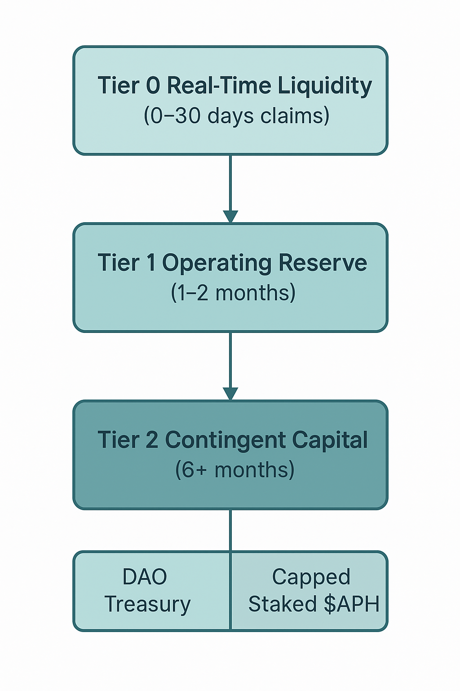

> Forward‑Looking Statement: This document contains forward‑looking statements subject to significant risks and uncertainties. Nothing herein is investment, legal, or medical advice. Features, timelines, and parameters are examples and remain subject to DAO approval and market/regulatory conditions.

# Claims Liquidity Waterfall

Apollo pays approved claims through a predefined waterfall that prioritises readily available funds and protects long‑term capital.  The waterfall logic is codified in smart contracts and enforced transparently on‑chain.【214961381664349†L642-L687】.

## Overview

1. **Tier 0 – Real‑Time Liquidity:** Claims are paid first from the on‑hand USDC buffer (Tier 0)【214961381664349†L642-L651】.  This buffer covers day‑to‑day claims and is continuously refilled by contributions.【214961381664349†L618-L623】.
2. **Current Contributions:** Incoming member contributions are swept into Tier 0 to replenish amounts spent【214961381664349†L653-L659】.
3. **Tier 1 Reserve Draw:** If Tier 0 cannot be fully replenished, funds are drawn from the Tier 1 operating reserve【214961381664349†L661-L666】.
4. **Tier 2 Activation:** When Tier 1 is insufficient, Tier 2 is activated.  The DAO Treasury portion of Tier 2 is used first【214961381664349†L670-L677】.  Only after the treasury is depleted does the protocol liquidate staked $APH to raise USDC for claims【214961381664349†L670-L681】.  Any utilisation of Tier 2 raises alerts to the DAO.

External reinsurance may reimburse the protocol for extreme claims, but Apollo pays members upfront and then recovers from reinsurers【214961381664349†L697-L703】.

## Diagram

The following diagram visualises the waterfall sequence.  Tier 2 is split into the DAO Treasury and capped staked $APH, reflecting the order of use.



## Illustrative Pseudocode

```python
def pay_claim(claim_amount):
    # Step 1: use the Tier 0 buffer
    if claim_amount <= tier0_balance:
        tier0_balance -= claim_amount
        return
    
    # Step 2: top up Tier 0 with current contributions
    needed = claim_amount - tier0_balance
    tier0_balance = 0
    contributions_available = incoming_contributions()
    if contributions_available >= needed:
        use_contributions(needed)
        return
    else:
        use_contributions(contributions_available)
        needed -= contributions_available

    # Step 3: draw from Tier 1 reserve
    if tier1_balance >= needed:
        tier1_balance -= needed
        return
    else:
        needed -= tier1_balance
        tier1_balance = 0

    # Step 4: activate Tier 2
    # 4a: use DAO Treasury first
    if dao_treasury_balance >= needed:
        dao_treasury_balance -= needed
        return
    else:
        needed -= dao_treasury_balance
        dao_treasury_balance = 0
    
    # 4b: liquidate staked APH tokens (capped)
    liquidated = liquidate_staked_tokens(min(needed, staked_aph_liquidation_cap))
    if liquidated < needed:
        # any shortfall triggers emergency procedures (governance call)
        raise InsufficientReservesError
```

This pseudocode is for illustration only.  Real implementation will include asynchronous operations, reinsurance reimbursements and governance hooks.

> Forward‑Looking Statement: This document contains forward‑looking statements subject to significant risks and uncertainties. Nothing herein is investment, legal, or medical advice. Features, timelines, and parameters are examples and remain subject to DAO approval and market/regulatory conditions.